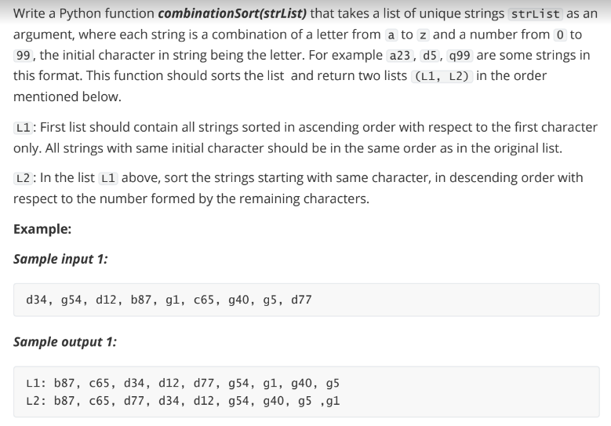
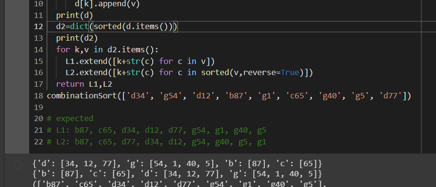

- Test Case 1

|Input|Expected Output|
|---|---|
|d34, g54, d12, b87, g1, c65, g40, g5, d77|L1: b87, c65, d34, d12, d77, g54, g1, g40, g5 <br>L2: b87, c65, d77, d34, d12, g54, g40, g5, g1|

- solution
```
def combinationSort(x):
  d={}
  L1=[]
  L2=[]
  for i in x:
    k,v=i[0],int(i[1:])
    if k not in d:
      d[k]=[v]
    else:
      d[k].append(v)
  d2=dict(sorted(d.items()))
  for k,v in d2.items():
    L1.extend([k+str(c) for c in v])
    L2.extend([k+str(c) for c in sorted(v,reverse=True)])
  return L1,L2 
  ```
  - idea behind this:
    - create a dictionary with key as 'alphabets' and values as 'list of numbers'
    - once the dictionary is created sort it based on items
    - then the code is self explanatory
 
    - 
    - the above image is to explain  12 line 
        - from image we can see before line 12 we have dictionary according to input
        - after line 12 we have sorted the dictionary according to the keys in ascending order

    - steps to follow
        - initialize  `d,l1,l2`
        - create a dictionary with keys as alpha and values as list of numerics
        - sort the dict
        - then the rest is easy