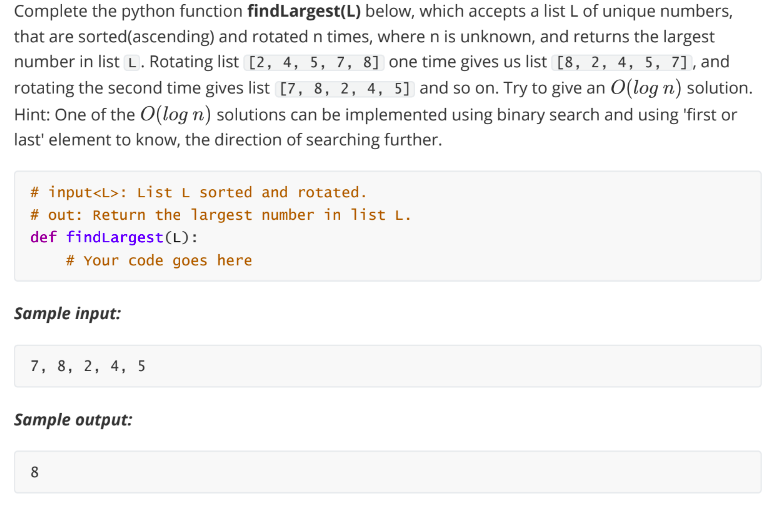

```
#python
def findLargest(L):
  left = 0
  s = len(L)
  right = s-1
  
  # If list has only one element, that is the max.
  if (s==1):
    return L[0]
    
  while (left<=right):
    mid=(left+right)//2  # defining the center position
    
    # if mid is at last index, next element to compare will be at index 0
    if (mid == s-1):
      nextToMid = 0  
    else:
      nextToMid = mid+1

    if (L[mid] > L[nextToMid]): #if mid is greater than next , it will be biggest.
      return L[mid]
    elif (L[mid] < L[0]): 
      # our element is in left of mid
      right = mid-1
    else:
      # our element is in right of mid
      left = mid+1
print(findLargest([7 ,8 ,2 ,4 ,5 ,6]))
```

- steps:
    - take pointers left ,right size, where right is size-1 and left=0
    - while left<=right ,mid=left+right//2
    - if mid is at last index, next to mid =0,
    else next to mid= mid+1
    - if l[mid]>l[nexttomid]
        - return l[mid] because we know that if next is smaller than the current, then current is the largest
    - if l[mid]<l[0]:
        - our biggest value is in left of the mid
        - right=mid+1
    - else
        - left=mid+1 